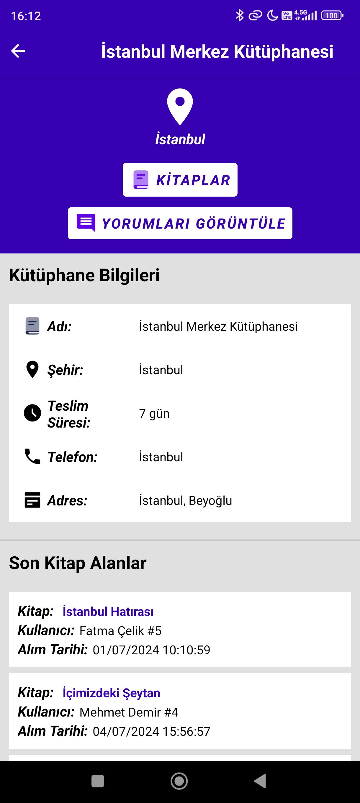

# Android-Notepad-App-Kotlin
Kotlin (MVVM - Clean Architecture) Android kutuphane uygulaması.

---
## Kütüphane Özellikleri
* Kayıt olma / giriş yapma
* Kütüphaneye kitap ekleme
* Yeni kitap oluşturma
* Google Books API ile kitap bilgilerine erişme
* Kitap ödünç alma isteklerini onaylama / reddetme
* Kitap teslim durumunu yönetme
* Kitap bilgilerini görüntüleme
* Kullanıcı bilgilerini görüntüleme

## Kullanıcı Özellikleri
* Kayıt olma / giriş yapma
* Kütüphaneleri görüntüleme
* Kütüphanelere yorum yapma
* Kitap ödünç alma isteği gönderme
* Kitaplara yorum yapma
* Bekleyen kitap ödünç alma isteklerini iptal etme
* Onaylanan ve reddedilen kitap isteklerini görüntüleme

---
## Uygulama Videosu

https://github.com/samet-ozkan/Android-Kutuphane-App-Kotlin/assets/55306181/7b429e34-e3d3-499d-868b-bb749a846efb

---
## Kullanılan Teknolojiler
* SharedPreferences
* Retrofit
* Coroutine
* Dagger-Hilt
* ViewModel
* LiveData
* DataBinding

---
## Ekran Görüntüleri
<table>
  <tr>
    <td align="center"></td>
    <td align="center"></td>
    <td align="center"></td>
  </tr>
  <tr>
    <td align="center"></td>
    <td align="center"></td>
    <td align="center"></td>
  </tr>
   <tr>
    <td align="center"></td>
    <td align="center"></td>
    <td align="center"></td>
  </tr>
   <tr>
    <td align="center"></td>
    <td align="center"></td>
    <td align="center"></td>
  </tr>
     <tr>
    <td align="center"></td>
    <td align="center"></td>
    <td align="center"></td>
  </tr>
    <tr>
    <td align="center"></td>
    <td align="center"></td>
    <td align="center"></td>
  </tr>
     <tr>
    <td align="center"></td>
    <td align="center"></td>
    <td align="center"></td>
  </tr>
    <tr>
    <td align="center"></td>
    <td align="center"></td>
    <td align="center"></td>
  </tr>
</table>

---
## İletişim

Email: <a href="mailto:samet-ozkan@outlook.com">samet-ozkan@outlook.com</a>

